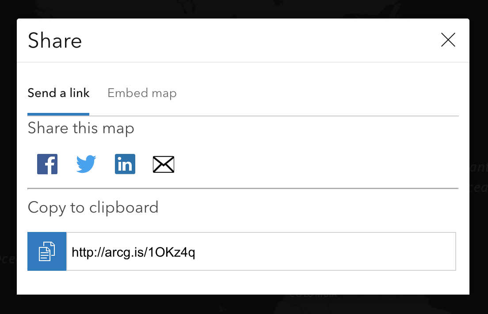

# share-widget

Share widget built for version 4.x of the ArcGIS API for Javascript

​

## Features:

1.  `MapView` and `SceneView` compatability
2.  Share map via URL
3.  Embed map with Iframe code
4.  Share item services, i.e. social media or e-mail
5.  Client-side projection for non-Web Mercator/non-WGS84 spatial references
6.  Customizable Share Items
    - _Default items: Facebook, Twitter, LinkedIn, and Email_
7.  Customizable Share Features (All features toggled on by default):
    - Copy URL to clipboard
    - Share Services, i.e. Social Media or Email
    - Shorten URL
    - Embed Map

**\*Note:** Share Widget uses Esri's Calcite CSS Styles.\*

Calcite Web Documentation: https://esri.github.io/calcite-web/documentation/

## ShareWidget

### Constructor:

#### new **ShareWidget(_properties?_)**

##### Property Overview:

| Name             | Type                    | Summary                                     |
| ---------------- | ----------------------- | ------------------------------------------- |
| iconClass        | String                  | The widget's default CSS icon class.        |
| label            | String                  | The widget's default label.                 |
| shareFeatures    | ShareFeatures           | A reference to `ShareFeatures`.             |
| shareItems       | Collection\<ShareItem\> | Collection of `ShareItem` class.            |
| shareModalOpened | Boolean                 | Property to toggle share modal              |
| shareUrl         | String                  | Share URL of web application. `Read-only`   |
| viewModel        | ShareViewModel          | The view model for this widget.             |
| view             | MapView \| SceneView    | A reference to the `MapView` or `SceneView` |

## ShareItem

### Constructor:

#### new **ShareItem(_properties?_)**

##### Property Overview:

| Name        | Type   | Summary                                                                                                                                             |
| ----------- | ------ | --------------------------------------------------------------------------------------------------------------------------------------------------- |
| className   | String | Class name of share item icon.                                                                                                                      |
| id          | String | Unique ID of share item service i.e. `facebook`, `twitter`, `linkedin`, `email`, etc.                                                               |
| name        | String | Name of Share Item.                                                                                                                                 |
| urlTemplate | String | URL template of share item. Consists of share service URL along with URL parameters i.e `"https://pinterest.com/pin/create/bookmarklet?&url={url}"` |

## ShareFeatures

### Constructor:

#### new **ShareFeatures(_properties?_)**

##### Property Overview:

| Name            | Type    | Summary                                      |
| --------------- | ------- | -------------------------------------------- |
| copyToClipboard | Boolean | Toggles copy share URL to clipboard feature. |
| embedMap        | Boolean | Toggles embed map feature.                   |
| shareServices   | Boolean | Toggles share item services feature.         |
| shortenLink     | Boolean | Toggles shorten URL feature.                 |

**Please note:** Both `copyToClipboard` and `shareServices` properties **cannot** be toggled off concurrently.

## ShareViewModel

### Constructor:

#### new **ShareViewModel(_properties?_)**

##### Property Overview:

| Name             | Type                    | Summary                                     |
| ---------------- | ----------------------- | ------------------------------------------- |
| embedCode        | String                  | IFrame Embed Code `Read-only`.              |
| shareFeatures    | ShareFeatures           | A reference to `ShareFeatures`.             |
| shareItems       | Collection\<ShareItem\> | Collection of `ShareItem` class.            |
| shareModalOpened | Boolean                 | Property to toggle share modal              |
| shareUrl         | String                  | Share URL of web application. `Read-only`   |
| state            | String                  | Current state of the widget.                |
| view             | MapView \| SceneView    | A reference to the `MapView` or `SceneView` |

### **Examples:**

##### Default:

```
const share = new ShareWidget({
    view,
    container: document.createElement("div")
});
```

##### Custom:

```
  const PINTEREST_ITEM = new ShareItem({
    id: "pinterest",
    name: "pinterest",
    className: "icon-social-pinterest",
    urlTemplate:
      "https://pinterest.com/pin/create/bookmarklet?&url={url}"
  });
  const REDDIT_ITEM = new ShareItem({
    id: "reddit",
    name: "Reddit",
    className: "icon-social-share",
    urlTemplate: "https://reddit.com/submit?url={url}"
  });
  const LINKED_IN = new ShareItem({
    id: "linkedin",
    name: "LinkedIn",
    className: "icon-social-linkedin",
    urlTemplate: "https://linkedin.com/shareArticle?url={url}"
  });

  const shareFeatures = new ShareFeatures({
    copyToClipboard: false,
    embedMap: false
  });
  const ShareItemCollection = Collection.ofType<ShareItem>(ShareItem);
  const shareItems = new ShareItemCollection([
    PINTEREST_ITEM,
    REDDIT_ITEM,
    LINKED_IN
  ]);
  const share = new ShareWidget({
    view,
    shareFeatures,
    shareItems
  });
```

## Resources

- [ArcGIS for JavaScript API Resource Center](http://help.arcgis.com/en/webapi/javascript/arcgis/index.html)
- [ArcGIS Blog](http://blogs.esri.com/esri/arcgis/)
- [twitter@esri](http://twitter.com/esri)

## Issues

Find a bug or want to request a new feature? Please let us know by submitting an issue.

## Contributing

Esri welcomes contributions from anyone and everyone. Please see our [guidelines for contributing](https://github.com/esri/contributing).

## Licensing

Copyright 2019 Esri

Licensed under the Apache License, Version 2.0 (the "License");
you may not use this file except in compliance with the License.
You may obtain a copy of the License at

http://www.apache.org/licenses/LICENSE-2.0

Unless required by applicable law or agreed to in writing, software
distributed under the License is distributed on an "AS IS" BASIS,
WITHOUT WARRANTIES OR CONDITIONS OF ANY KIND, either express or implied.
See the License for the specific language governing permissions and
limitations under the License.

A copy of the license is available in the repository's [LICENSE](LICENSE) file.
